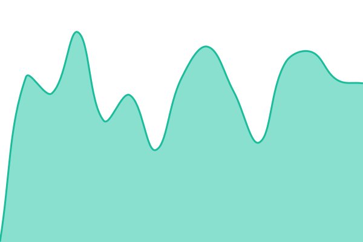

# [📈 Live Status](https://status.postra.pl): <!--live status--> **🟩 All systems operational**

This repository contains the open-source uptime monitor and status page for [Krzysztof Rzepka](https://krisgrzepka.com/), powered by [Upptime](https://github.com/upptime/upptime).

With [Upptime](https://upptime.js.org), you can get your own unlimited and free uptime monitor and status page, powered entirely by a GitHub repository. We use [Issues](https://github.com/KrisRz/postra-status/issues) as incident reports, [Actions](https://github.com/KrisRz/postra-status/actions) as uptime monitors, and [Pages](https://status.postra.pl) for the status page.

<!--start: status pages-->
<!-- This summary is generated by Upptime (https://github.com/upptime/upptime) -->
<!-- Do not edit this manually, your changes will be overwritten -->
<!-- prettier-ignore -->
| URL | Status | History | Response Time | Uptime |
| --- | ------ | ------- | ------------- | ------ |
|  [Postra App (API health)](https://app.postra.pl/api/monitor/queue/main) | 🟩 Up | [postra-app-api-health.yml](https://github.com/KrisRz/postra-status/commits/HEAD/history/postra-app-api-health.yml) | 

 441ms
     
 | 

<a href="https://status.postra.pl/history/postra-app-api-health">92.70%</a>
    

|  [Postra Landing](https://postra.pl) | 🟩 Up | [postra-landing.yml](https://github.com/KrisRz/postra-status/commits/HEAD/history/postra-landing.yml) | 

 276ms
     
 | 

<a href="https://status.postra.pl/history/postra-landing">100.00%</a>
    

|  [Postra CDN](https://cdn-dev.postra.pl) | 🟩 Up | [postra-cdn.yml](https://github.com/KrisRz/postra-status/commits/HEAD/history/postra-cdn.yml) | 

 460ms
     
 | 

<a href="https://status.postra.pl/history/postra-cdn">8.71%</a>
    

<!--end: status pages-->

[**Visit our status website →**](https://status.postra.pl)

## 📄 License

- Powered by: [Upptime](https://github.com/upptime/upptime)
- Code: [MIT](./LICENSE) © [Anand Chowdhary](https://anandchowdhary.com)
- Data in the `./history` directory: [Open Database License](https://opendatacommons.org/licenses/odbl/1-0/)
